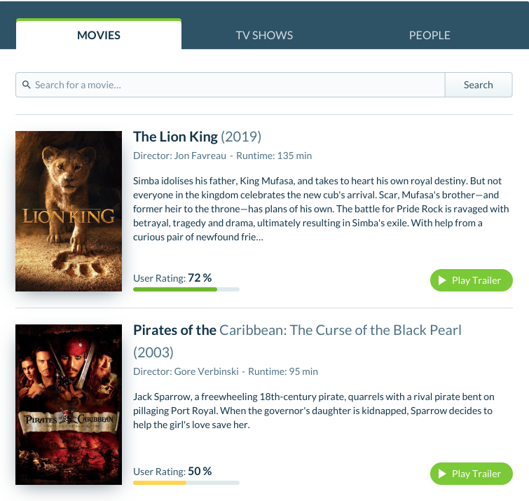
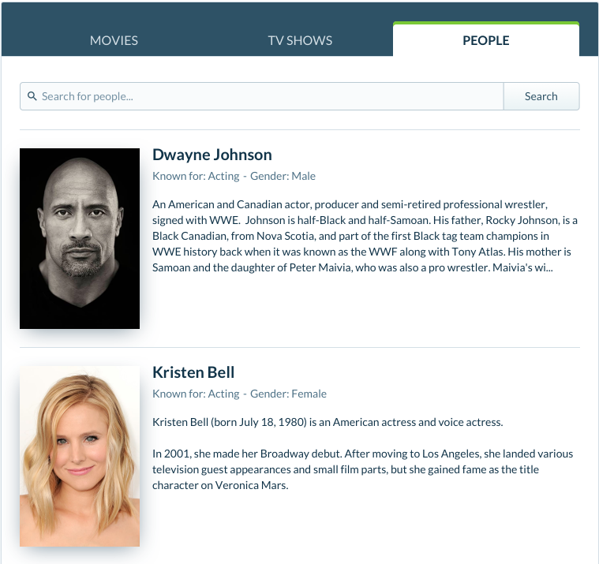

# Comvex Front-end Assessment

The goal of this assessment is to learn about an applicant's approach to building re-usable components. Please be ready to talk about the technical and design choices you made.

## Movie Search Component

The task is to build a component (widget) that displays movies, tv shows, and people using the [The Movie DB](https://developers.themoviedb.org/3/getting-started/introduction) api.

**Please write your code as you would in a professional environment (ready to be submitted for a PR)**

You will receive a link to our design tool [Invision](https://www.invisionapp.com/) with a password to view the design. Below are screenshots of what the component should look like.

| Movie Tab                                            | People Tab                                           |
| :--------------------------------------------------- | :--------------------------------------------------- |
|  |  |

### Minimum Requirements

- The component should be able to search movies, tv shows, & people. **The results should only be relevant to the current tab, e.g. if you are on the movie tab only movies show in the results**
- Please match the design as closely as possible. Any extra UI elements must maintain the original design language
- Code to be submitted via a public repository or online code platform (Github, BitBucket, CodeSandbox, StackBlitz, etc...)
- README with an explanation how to build the project

### Optional Features

Before adding any extra features please make sure they are complete. We would rather see just the minimum requirements than half finished features. Either way you **will** be asked your thoughts on implementing the following features:

- Updating the url with search term
- Dedicated entry points for the tabs (remember this is not a page but a component and the component should be able to be dropped into any site/app)
- Multiple thumbnails
- Inline movie trailer
- Search as you type
- Sensible animations/transitions
- Infinite scroll/pagination
- Lazy loading images
- Truncating long descriptions/bios
- Tests

### Technology Requirements

Use any library/framework you feel comfortable with. However, the position requires professional level ability with React.

### Hints

- There are [multiple endpoints for searching](https://developers.themoviedb.org/3/search/multi-search)

## Deadline

There is no hard deadline but try and submit your work within 7 days. If you need more time please let us know by sending an email.
