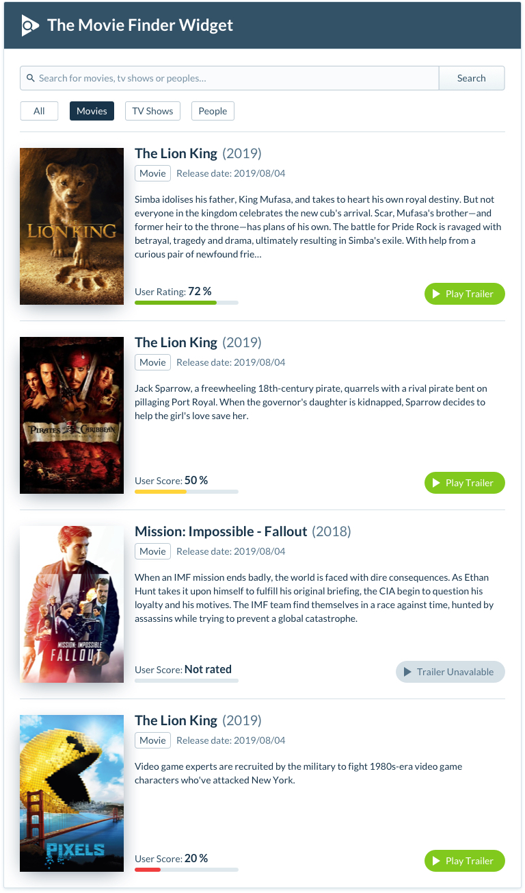
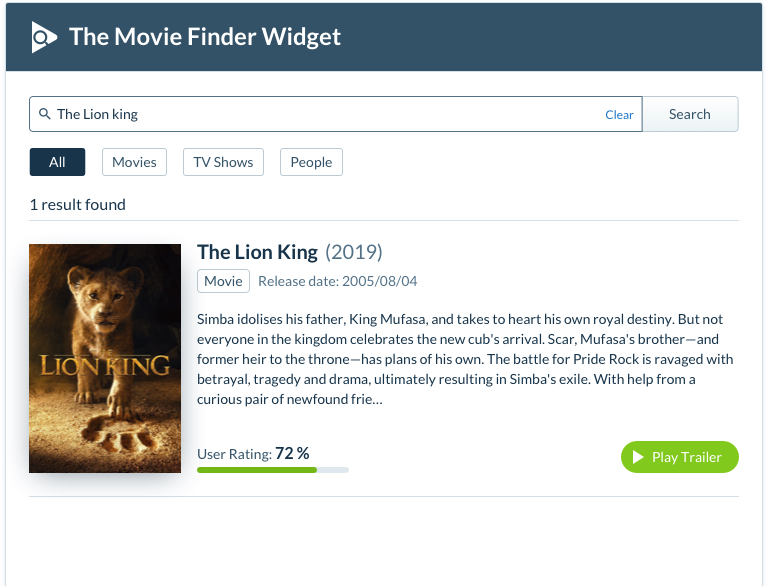

# Comvex Frontend Assessment

The goal of this assessment is to learn about an applicant's approach to building re-usable components. Please be ready to talk about the technical and design choices you made.

## Movie Search Component

The task is to build a component (widget) that displays movies, TV shows, and people using the [The Movie DB](https://developers.themoviedb.org/3/getting-started/introduction) API.

**Please write your code as you would in a professional environment (ready to be submitted for a PR).**

| All Filter                                          | Movie Filter                                      |
| :-------------------------------------------------- | :------------------------------------------------ |
|       |  |

| Search Results                                                                                          | 
| :------------------------------------------------------------------------------------------------------ | 
|                                                |

**Please check our [InVision Assessment Project](https://invis.io/TWTATYNZ9XC) to have a clear view of what the component should look like.**

> The password to access the project will be sent to you separately.

### Minimum Requirements

- The component should use the [multi search endpoint](https://developers.themoviedb.org/3/search/multi-search) to search movies, TV and people.
- Client-side filtering (movies, TV, and people)
- Movie and TV show results should display a button allowing the user to view the trailer using the [movie](https://developers.themoviedb.org/3/movies/get-movie-videos) and [TV](https://developers.themoviedb.org/3/tv/get-tv-videos) video endpoints.
- Please match the original design as closely as possible. Any extra UI elements must maintain the original design language.
- Deliver your code via a public repository or online code platform (GitHub, BitBucket, CodeSandbox, StackBlitz, etc...).
- Provide a `README.md` file with an explanation on how to install & run your project.

### Optional Features

- Updating the URL with search term/filters
- Multiple thumbnails
- Inline movie trailer
- Search as you type
- Sensible animations/transitions
- Infinite scroll/pagination
- Lazy loading images
- Truncating long descriptions/bios
- Tests

**Important**: Before adding any extra features, please make sure you completed the minimum requirements. We would rather just see them properly done than half finished features. Either way you will be asked your thoughts on implementing the optional features.

### Technology Requirements

Use any library/framework you feel comfortable with. However, the position requires professional level ability with React.

## Deadline

There is no hard deadline but try and submit your work within 10 days. If you need more time please let us know by sending an email.

**GLHF**
